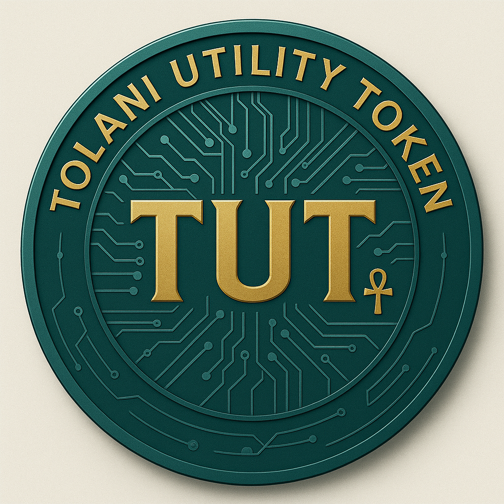

# TUT Token Branding Guide

## Overview

The Tolani Utility Token (TUT) is the centerpiece of the Tolani ecosystem.  This guide provides detailed branding specifications for the token’s visual identity to ensure consistency across all media.  The final production‐grade token design combines a rich teal base with golden typography to convey modern utility, professionalism and heritage.  Circuits radiate from the center to evoke blockchain connectivity and digital sophistication.

## Color Palette

| Component | Description | Hex Code |
|---|---|---|
| **Base Teal** | Primary background of the token. Creates a modern and trustworthy feel. | `#004D4D` (approximate) |
| **Highlight Teal** | Subtle gradients and ring highlights. | `#007373` (approximate) |
| **Gold Text** | Typography for “TUT” and “Tolani Utility Token” around the rim.  Stands out against the teal base. | `#E5C64B` (approximate) |
| **Circuit Lines** | Lighter teal used for circuitry patterns. | `#00AFAF` (approximate) |

> *Note: Actual color values may vary slightly due to rendering.  When implementing the token graphic, use these hex codes as a baseline and adjust minimally for context.*

## Typography

The token uses clean, sans‑serif lettering to ensure clarity and modernity.  The primary typeface should be similar to **DejaVu Sans** or **Montserrat**, both of which offer high legibility at small sizes.  The letters “TUT” appear centrally in uppercase, while the outer ring contains “TOLANI UTILITY TOKEN” repeated evenly around the rim.

## Iconography & Symbols

- **Circuits:**  The token surface contains intricate circuit lines and nodes, representing the technological foundation of the blockchain.
- **Ankh:**  A subtle ankh symbol at the bottom hints at the Tolani brand’s historical inspiration and longevity without distracting from the design.
- **Concentric Rings:**  Multiple rings create depth and motion, mirroring the layered nature of modern L2 networks and cross‑chain interoperability.

## Usage Guidelines

1. **Digital Icons:**  Export high‑resolution assets (e.g. 512×512 px and 1024×1024 px) from the SVG or PNG source.  Create smaller variants (256×256 px, 128×128 px, 64×64 px) for favicons, mobile app icons and UI elements.
2. **Print Materials:**  When reproducing the token on physical items, maintain a diameter between 20–25 mm for coins and keychains.  For larger promotional displays, ensure the teal/gold contrast is preserved.
3. **Backgrounds:**  Use the token over dark or neutral backgrounds to preserve contrast.  Avoid placing the token on similarly saturated teal or gold backgrounds.
4. **Modifications:**  Do not alter the colors, proportions or typography without approval.  Additional elements (e.g. logos, text) should be placed outside the outer rim to preserve the token’s integrity.

## Asset Files

This repository includes the final production token graphic in `assets/tut_token_production.png`.  Developers and designers should refer to this file for all future integrations.  If you require vector versions (SVG), please contact the design team or generate it from the source graphic.
